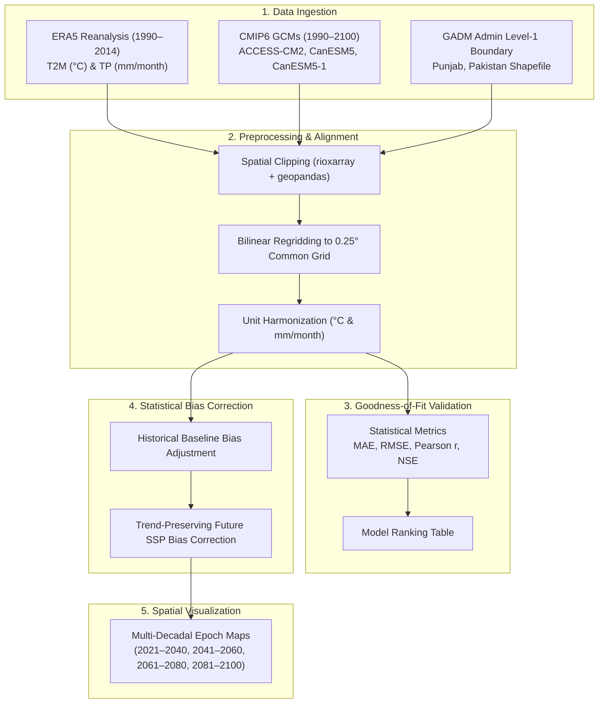
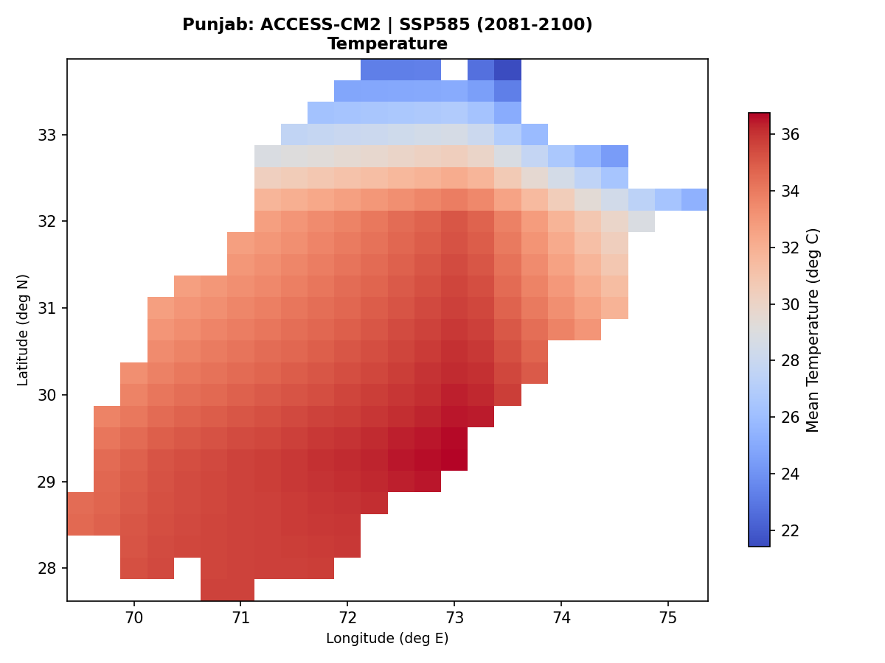
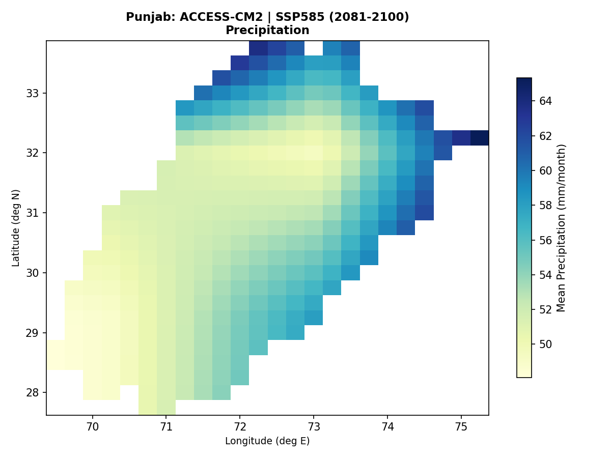

# Regional Climate Downscaling, Bias Correction & Projection Pipeline
### Regional Climate Analysis for Punjab, Pakistan (1990–2100) using CMIP6 & ERA5


---

## 📌 Overview

This repository implements an end-to-end geospatial and climatological data processing pipeline for **regional climate change downscaling, historical model validation, statistical bias correction, and multi-decadal projections** over **Punjab, Pakistan**.

The study evaluates and downscales multiple Global Climate Models (GCMs) from the **Coupled Model Intercomparison Project Phase 6 (CMIP6)** against high-resolution **ERA5 Reanalysis** data, projecting temperature and precipitation trends across four Shared Socioeconomic Pathways (**SSP1-2.6, SSP2-4.5, SSP3-7.0, and SSP5-8.5**) through **2100**.



---

## 🌍 Datasets & Study Area

- **Study Domain:** Punjab Province, Pakistan ($27.75^\circ\text{N} - 33.75^\circ\text{N}$, $69.5^\circ\text{E} - 75.25^\circ\text{E}$).
- **Observational Reference:** **ERA5 Reanalysis** (ECMWF) at monthly temporal resolution and $0.25^\circ \times 0.25^\circ$ spatial grid.
- **Climate Models (CMIP6):**
  - **ACCESS-CM2** (CSIRO-ARCCSS, Australia)
  - **CanESM5** (Canadian Centre for Climate Modelling and Analysis)
  - **CanESM5-1** (Canadian Centre for Climate Modelling and Analysis)
- **Scenarios:**
  - **Historical:** 1990–2014 (Baseline evaluation)
  - **Future Scenarios:** SSP1-2.6, SSP2-4.5, SSP3-7.0, and SSP5-8.5 (2015–2100)

---

## 🔬 Methodology

### 1. Spatial Harmonization & Regridding
Raw GCMs have differing native spatial grids. The pipeline resamples all models onto a uniform $0.25^\circ \times 0.25^\circ$ grid matching ERA5 using bilinear interpolation (`xarray.interp`), bounded regionally over Punjab to optimize processing time and memory.

### 2. Unit Harmonization
- **Near-Surface Temperature ($tas$):** Converted from Kelvin to Celsius ($^\circ\text{C} = K - 273.15$).
- **Precipitation ($pr$):** Converted from mass flux ($\text{kg}\cdot\text{m}^{-2}\cdot\text{s}^{-1} \equiv \text{mm/s}$) to monthly accumulation ($\text{mm/month} = \text{pr} \times 86400 \times 30$). ERA5 daily accumulated forecast precipitation is similarly standardized to monthly totals.

### 3. Model Skill Assessment (Goodness-of-Fit)
Models are validated against ERA5 across the historical baseline (1990–2014) using:
- **MAE** (Mean Absolute Error)
- **RMSE** (Root Mean Square Error)
- **Pearson Correlation Coefficient ($r$)**
- **NSE** (Nash–Sutcliffe Efficiency)

$$\text{NSE} = 1 - \frac{\sum (y_{\text{obs}} - y_{\text{sim}})^2}{\sum (y_{\text{obs}} - \bar{y}_{\text{obs}})^2}$$

### 4. Trend-Preserving Bias Correction
Baseline historical bias is computed as:
$$\text{Bias} = \bar{X}_{\text{model, hist}} - \bar{X}_{\text{ERA5, hist}}$$

Future SSP projections are corrected by removing the systematic historical offset while preserving the simulated warming and precipitation change signal:
$$X_{\text{SSP, corrected}} = X_{\text{SSP, raw}} - \text{Bias}$$

Physical constraints are enforced (precipitation is bounded at $\ge 0$).

---

## 📊 Key Results

### Historical Model Validation (1990–2014)

| Variable | Model | MAE | RMSE | Correlation ($r$) | NSE | Overall Rank |
| :--- | :--- | :---: | :---: | :---: | :---: | :---: |
| **Near-Surface Temp ($tas$)** | **CanESM5** | **3.10 °C** | **3.93 °C** | **0.95** | **0.75** | **1** |
| | ACCESS-CM2 | 3.18 °C | 3.97 °C | 0.94 | 0.74 | 2 |
| | CanESM5-1 | 4.01 °C | 4.71 °C | 0.94 | 0.63 | 3 |
| **Precipitation ($pr$)** | **ACCESS-CM2** | **38.74 mm** | **69.01 mm** | 0.02 | -0.40 | **1** |
| | CanESM5 | 39.07 mm | 69.25 mm | 0.01 | -0.41 | 2 |
| | CanESM5-1 | 47.58 mm | 73.22 mm | 0.28 | -0.57 | 2 |

### Projected Future Changes (Punjab Baseline: 24.71 °C | 40.95 mm/month)

Under **ACCESS-CM2**:
- **SSP1-2.6 (Low Emissions):** $+1.96^\circ\text{C}$ warming | $+1.74\text{ mm/month}$ precipitation
- **SSP2-4.5 (Middle of the Road):** $+3.02^\circ\text{C}$ warming | $+3.13\text{ mm/month}$ precipitation
- **SSP3-7.0 (Regional Rivalry):** $+4.00^\circ\text{C}$ warming | $+5.53\text{ mm/month}$ precipitation
- **SSP5-8.5 (Fossil-fueled Development):** $+4.81^\circ\text{C}$ warming | $+6.56\text{ mm/month}$ precipitation

---

## 🗺️ Sample Visualizations

Below are sample multi-decadal climatology maps generated by the pipeline:

| ACCESS-CM2 | SSP5-8.5 (2081–2100) — Far Future |
| :---: | :---: |
| **Temperature** |  |
| **Precipitation** |  |

---

## 📂 Project Structure

```text
├── gadm41_PAK_1.*             # Administrative boundary shapefile (Pakistan Level 1)
├── maps/                      # 96 Generated multi-decadal climatology PNG maps
├── notebooks/
│   └── models_list.txt        # CMIP6 model inventory
├── outputs/
│   ├── clipped_logs/          # Dataset inspection logs
│   ├── goodness_of_fit_results.csv # Model performance rankings
│   └── [model]/[scenario]/    # Clipped & bias-corrected NetCDF outputs
├── scripts/
│   ├── align_era5.py          # ERA5 dimension standardization & unit conversion
│   ├── clip_era5.py           # Spatial subsetting of ERA5 temperature
│   ├── clip_era5_pr.py        # Spatial subsetting of ERA5 precipitation
│   ├── clip_models.py         # CMIP6 regridding & clipping to Punjab
│   ├── correct_historical.py  # Historical additive mean bias correction
│   ├── correct_SSPsmodels.py  # Trend-preserving future projection bias correction
│   ├── gf_test_and_rank.py    # Goodness-of-Fit evaluation & ranking
│   ├── mapSSPs.py             # Multi-decadal spatial mapping (Matplotlib)
│   └── read_and_explore.py    # NetCDF metadata diagnostics
├── run_pipeline.py            # Master workflow runner
├── requirements.txt           # Python package dependencies
├── .gitignore                 # Excludes heavy raw NetCDF files (>6.5 GB)
└── README.md                  # Project documentation
```

---

## 🚀 Setup & Execution

### 1. Clone & Install Dependencies
```bash
git clone https://github.com/<your-username>/regional-climate-downscaling-punjab.git
cd regional-climate-downscaling-punjab

# Create and activate virtual environment
python -m venv .venv
source .venv/bin/activate  # On Windows: .venv\Scripts\activate

# Install required packages
pip install -r requirements.txt
```

### 2. Download Data
- **ERA5 Data:** Download monthly averaged near-surface temperature (`2m_temperature`) and total precipitation (`total_precipitation`) from the [Copernicus Climate Data Store (CDS)](https://cds.climate.copernicus.eu/).
- **CMIP6 Models:** Download historical and SSP runs (`tas` and `pr`) from the [Earth System Grid Federation (ESGF)](https://esgf-node.llnl.gov/projects/cmip6/). Place them into the `models/` directory.

### 3. Run the Full Pipeline
Run the master pipeline script:
```bash
python run_pipeline.py
```
Or execute individual components:
```bash
# 1. Standardize observation reanalysis
python scripts/align_era5.py

# 2. Regrid and clip CMIP6 models
python scripts/clip_models.py

# 3. Model validation & ranking
python scripts/gf_test_and_rank.py

# 4. Bias correction
python scripts/correct_historical.py
python scripts/correct_SSPsmodels.py

# 5. Generate climatology maps
python scripts/mapSSPs.py
```

---

## 📄 License
This project is licensed under the MIT License - see the LICENSE file for details.
